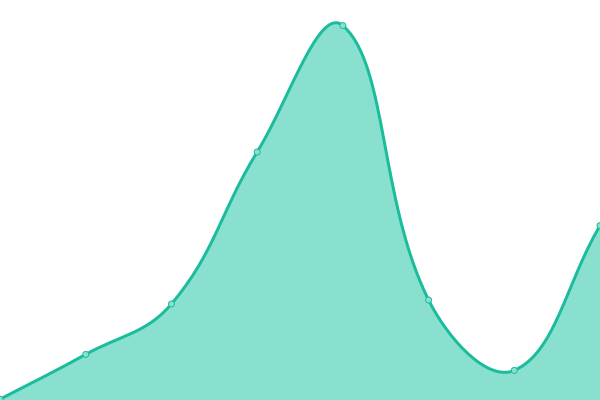

# [📈 Live Status](https://prateekralhan.github.io/status): <!--live status--> **🟩 All systems operational**

This repository contains the open-source uptime monitor and status page for [Prateek Ralhan](https://prateekralhan.github.io), powered by [Upptime](https://github.com/upptime/upptime).

With [Upptime](https://upptime.js.org), you can get your own unlimited and free uptime monitor and status page, powered entirely by a GitHub repository. We use [Issues](https://github.com/prateekralhan/status/issues) as incident reports, [Actions](https://github.com/prateekralhan/status/actions) as uptime monitors, and [Pages](https://prateekralhan.github.io/status) for the status page.

<!--start: status pages-->
<!-- This summary is generated by Upptime (https://github.com/upptime/upptime) -->
<!-- Do not edit this manually, your changes will be overwritten -->
<!-- prettier-ignore -->
| URL | Status | History | Response Time | Uptime |
| --- | ------ | ------- | ------------- | ------ |
|  [Prateek Ralhan - Portfolio](https://prateekralhan.github.io/) | 🟩 Up | [prateek-ralhan-portfolio.yml](https://github.com/prateekralhan/status/commits/HEAD/history/prateek-ralhan-portfolio.yml) | 

 151ms
     
 | 

<a href="https://prateekralhan.github.io/status/history/prateek-ralhan-portfolio">100.00%</a>
    

|  [Prateek Ralhan - Portfolio (neomorphism) - Vercel](https://prateekralhan.vercel.app/) | 🟩 Up | [prateek-ralhan-portfolio-neomorphism-vercel.yml](https://github.com/prateekralhan/status/commits/HEAD/history/prateek-ralhan-portfolio-neomorphism-vercel.yml) | 

 118ms
     
 | 

<a href="https://prateekralhan.github.io/status/history/prateek-ralhan-portfolio-neomorphism-vercel">99.93%</a>
    

|  [Prateek Ralhan - Portfolio (neomorphism) - Netlify](https://prateekralhan.netlify.app/) | 🟩 Up | [prateek-ralhan-portfolio-neomorphism-netlify.yml](https://github.com/prateekralhan/status/commits/HEAD/history/prateek-ralhan-portfolio-neomorphism-netlify.yml) | 

 234ms
     
 | 

<a href="https://prateekralhan.github.io/status/history/prateek-ralhan-portfolio-neomorphism-netlify">100.00%</a>
    

|  [Bangalore - Realtime Weather Stats](https://bangalore-weather-stats.onrender.com/) | 🟩 Up | [bangalore-realtime-weather-stats.yml](https://github.com/prateekralhan/status/commits/HEAD/history/bangalore-realtime-weather-stats.yml) | 

 3066ms
     
 | 

<a href="https://prateekralhan.github.io/status/history/bangalore-realtime-weather-stats">75.28%</a>
    

|  [ChatGPT + DALL-E](https://streamlit-chatgpt-dalle2.onrender.com/) | 🟩 Up | [chat-gpt-dall-e.yml](https://github.com/prateekralhan/status/commits/HEAD/history/chat-gpt-dall-e.yml) | 

 2003ms
     
 | 

<a href="https://prateekralhan.github.io/status/history/chat-gpt-dall-e">78.13%</a>
    

|  [QRCode Generator](https://qrcode-generator.onrender.com/) | 🟩 Up | [qr-code-generator.yml](https://github.com/prateekralhan/status/commits/HEAD/history/qr-code-generator.yml) | 

 4187ms
     
 | 

<a href="https://prateekralhan.github.io/status/history/qr-code-generator">77.45%</a>
    

|  [Natural Language <2> SQL Query](https://natural-language-2-sql-queries.onrender.com/) | 🟩 Up | [natural-language-2-sql-query.yml](https://github.com/prateekralhan/status/commits/HEAD/history/natural-language-2-sql-query.yml) | 

 3855ms
     
 | 

<a href="https://prateekralhan.github.io/status/history/natural-language-2-sql-query">78.63%</a>
    

|  [ChatGPT Beyond 2021](https://chatgpt-beyond-2021.onrender.com/) | 🟩 Up | [chat-gpt-beyond-2021.yml](https://github.com/prateekralhan/status/commits/HEAD/history/chat-gpt-beyond-2021.yml) | 

 4010ms
     
 | 

<a href="https://prateekralhan.github.io/status/history/chat-gpt-beyond-2021">77.68%</a>
    

|  [Prateek Ralhan-Resume](https://prateek-online-resume-render.onrender.com/) | 🟩 Up | [prateek-ralhan-resume.yml](https://github.com/prateekralhan/status/commits/HEAD/history/prateek-ralhan-resume.yml) | 

 6450ms
     
 | 

<a href="https://prateekralhan.github.io/status/history/prateek-ralhan-resume">81.11%</a>
    

<!--end: status pages-->

[**Visit our status website →**](https://prateekralhan.github.io/status)

## 📄 License

- Powered by: [Upptime](https://github.com/upptime/upptime)
- Code: [MIT](./LICENSE) © [Prateek Ralhan](https://prateekralhan.github.io/)
- Data in the `./history` directory: [Open Database License](https://opendatacommons.org/licenses/odbl/1-0/)
